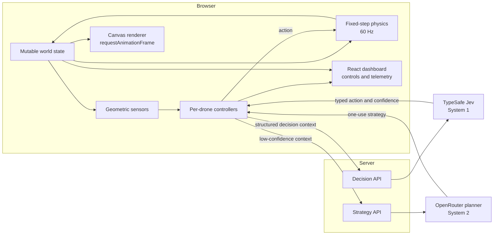
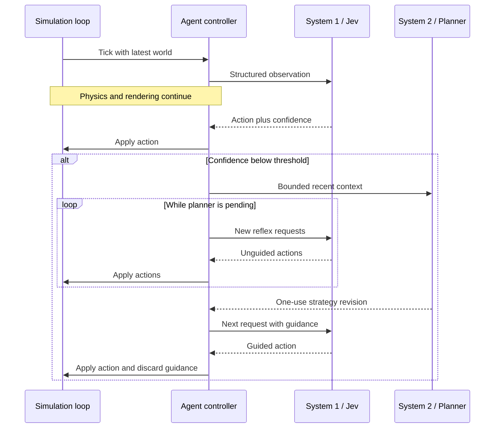

# Architecture

Jev Reflex Autonomy Lab is a browser-based, multi-drone autonomy simulation. It separates high-frequency simulation and rendering from provider calls and dashboard updates so that slow or unavailable AI services do not stop the world loop.

The system is an experiment, not a production flight controller. Positions and distances are expressed in metres, time in seconds, and angles in radians.

## System overview

No screenshots or canvas pixels are sent to either provider. Both receive bounded, structured JSON derived from the simulated world.

## Runtime model

The browser owns one mutable `World` containing the destination, objects, and a record of drones keyed by agent ID. The main animation loop advances physics in fixed `1/60`-second steps. Delta accumulation keeps movement independent of display frame rate, while large wall-clock gaps are capped before they enter the simulation.

Rendering and application UI run at different frequencies:

- `components/mission-canvas.tsx` renders the current world through Canvas 2D on `requestAnimationFrame`.
- `app/page.tsx` advances physics and schedules controller work without waiting for network responses.
- React dashboard state refreshes approximately four times per second.
- Chart time refreshes approximately once per second.

Provider latency therefore affects when a new decision becomes available, but it does not block physics, canvas rendering, or other drones.

## Per-drone control

Each drone has independent observation, decision, strategy, request, and telemetry state. Sensors report nearby world objects and active peer drones as geometric contacts. They calculate relative position and velocity, bearing, time to closest approach, and closest-approach distance; they do not choose an action.

The controller accepts one of seven typed actions:

`HOLD`, `TURN_LEFT`, `TURN_RIGHT`, `ACCELERATE`, `DECELERATE`, `SCAN`, or `RETREAT`.

Only one System 1 request and one System 2 request may be in flight for an agent at a time. Other agents continue independently if one request is slow or fails.

## System 1 and System 2

System 1 is the reflex layer. In Live API mode, TypeSafe Jev receives the latest observation, the available actions, short control memory, and the current strategy. It returns a validated action distribution, selected action, and confidence value. The local controller implements the same application contract for credential-free runs.

System 2 is optional and advisory. A System 1 decision below the configured confidence threshold starts an asynchronous planning request when no plan is already running and no returned guidance is waiting to be consumed. Jev continues making decisions while the planner responds.

Returned guidance is used by exactly one subsequent Jev request and then discarded. System 2 never applies an action or steers a frame directly.

Planning context is compacted to the 12 most recent observations and 12 most recent decisions. Strategy responses use strict structured output and are validated again inside the application.

## Provider boundary and failure handling

Browser providers call same-origin routes under `app/api`; credentials remain in server environment variables.

- `POST /api/decision` maps the internal decision contract to the TypeSafe Jev API. A transient Jev 5xx response is retried once within the request deadline.
- `POST /api/strategy` sends the compact planning context to OpenRouter. GLM 5.3 is the default planner; rate limits and 5xx responses retry once through the fallback model.
- Client requests have bounded timeouts, abort on reset or disposal, and ignore stale results from an earlier controller generation.
- Invalid payloads and provider outputs are rejected before they can change the world.

Mock providers are explicit development implementations. Live-provider failures do not silently substitute mock decisions.

## Telemetry semantics

Telemetry is recorded per agent from controller events rather than inferred from UI state:

- Green confidence represents a System 1 decision made without newly returned planner guidance.
- A purple confidence point represents the single Jev decision that consumed System 2 guidance.
- A dashed purple pulse marks the end of a System 2 request; it does not imply that System 2 controlled the intervening flight.
- Wall-clock response durations are retained separately from simulation timestamps.
- Provider failures are recorded explicitly; failed System 1 requests create confidence gaps rather than synthetic zero-confidence samples.

Mission export includes world state, observations, decisions, thresholds, provider timing, planning revisions, failures, and outcomes.

## Scenarios and repeatability

The hero scenario is curated. The seeded field uses deterministic pseudo-random geometry and deterministic unidentified-object placement for a given seed. A seed reproduces the initial simulation geometry, but live-provider latency and responses can still alter the resulting trajectory.

Physics owns movement, bounds, collisions, health, battery use, and arrival. Scanning changes an unidentified contact's observed classification; it does not prescribe an action.

## Code map

| Area | Primary files |
| --- | --- |
| World and physics | `lib/reflex/world.ts` |
| Sensors and projections | `lib/reflex/sensors.ts`, `lib/reflex/action-projection.ts` |
| Agent orchestration | `lib/reflex/controller.ts`, `lib/reflex/planning-context.ts` |
| Provider contracts and proxies | `lib/reflex/types.ts`, `lib/reflex/providers.ts` |
| Server adapters | `lib/reflex/jev-server.ts`, `lib/reflex/openrouter-server.ts` |
| API boundary | `app/api/decision/route.ts`, `app/api/strategy/route.ts` |
| Canvas rendering | `components/mission-canvas.tsx` |
| Telemetry charts | `lib/reflex/chart-data.ts`, `components/decision-charts.tsx` |
| Dashboard and experiment controls | `app/page.tsx` |
| Runtime checks | `tests/reflex.test.ts` |
