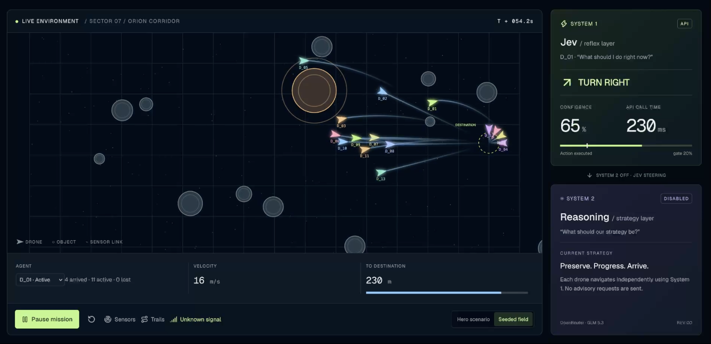

# Jev Reflex Autonomy Lab

An interactive multi-drone autonomy simulation powered by [TypeSafe Jev](https://docs.typesafe.ai/), exploring a simple question: what happens when fast, typed System 1 reflexes can ask a slower System 2 reasoning model for advice without giving up control?

The fleet size is configurable from one to fifteen drones. System 2 can be turned off entirely, making it easy to compare Jev operating independently against Jev augmented with strategic guidance.

<p align="center">
  <a href="https://khordoo.github.io/jev-reflex-autonomy-lab/watch-demo.html">
    
  </a>
</p>
<p align="center">
  <a href="https://khordoo.github.io/jev-reflex-autonomy-lab/watch-demo.html"><strong>▶ Play the simulation demo</strong></a>
</p>

Each drone navigates independently with Jev as its System 1 reflex layer. When confidence falls below the configured threshold, an optional System 2 planner provides one-use strategic guidance through [OpenRouter](https://openrouter.ai/). Jev keeps steering while the planner responds.

## What the demo shows

- A configurable fleet of one to fifteen independently controlled drones
- Moving asteroids, debris, unidentified objects, and other drones treated as sensed contacts
- A System 2 toggle for running Jev alone or enabling strategic advice
- Per-drone decisions, confidence, latency, strategy revisions, and collision outcomes
- Seeded scenarios for repeatable obstacle layouts
- Canvas rendering separated from React telemetry and controls
- JSON export for inspecting an entire mission after the run

If one drone collides, only that drone is removed. The remaining fleet continues toward the shared destination. Arrived drones leave the active flight lane.

## Architecture

```text
React dashboard
├── experiment controls
├── per-drone telemetry
└── decision and latency charts

Canvas simulation loop
├── movement and collision detection
├── sensors and action projections
└── fleet rendering

System 1 — TypeSafe Jev
└── fast typed action decisions for every active drone

System 2 — OpenRouter / GLM 5.3
└── asynchronous one-use strategy advice when confidence is low
```

System 2 is advisory. It does not fly the drone directly, and Jev does not pause while waiting for it. The confidence chart uses purple only for a Jev decision that actually consumed returned System 2 guidance. The System 2 chart marks response arrival as a discrete event; wall-clock duration is shown separately in the latency chart.

For the runtime model, provider boundaries, and System 1/System 2 request flow, see [Architecture](ARCHITECTURE.md).

## Run locally

Requirements: Node.js 22.13 or newer.

```bash
npm install
npm run dev
```

Open the printed local URL. The app starts with development mocks, so it works without provider credentials.

Useful checks:

```bash
npx tsc --noEmit
npm run lint
npm run build
```

## Use live providers

Copy the example configuration and add your own keys:

```bash
cp .dev.vars.example .dev.vars
```

```dotenv
# Runs Jev System 1 and the optional System 2 planner
OPENROUTER_API_KEY=your_key

# Optional: uncomment to prefer the direct TypeSafe route for System 1
# TYPESAFE_API_KEY=your_key

# Optional System 2 override; defaults to z-ai/glm-5.3
# OPENROUTER_MODEL=z-ai/glm-5.3
```

**No TypeSafe API key?** An OpenRouter key is enough to run the complete experiment.

- **OpenRouter only:** runs Jev System 1 and the optional System 2 planner.
- **Both keys:** uses TypeSafe directly for System 1 and OpenRouter for System 2.
- **TypeSafe only:** runs live System 1 when System 2 is turned off.

Restart the development server and refresh provider status in the dashboard, then use the **Local controller / Live API** toggle. The app boots into a **Local controller** — the built-in rule-based reflex, no credentials required — and only when **Live API** is selected do missions run against live TypeSafe Jev (and OpenRouter for System 2). The flight environment is simulated in both modes; the toggle only changes where reflex decisions come from. Selecting Live API sets a 20% starting gate but does not start a mission.

Then press **Launch mission** to begin flying. Adding credentials does not switch providers automatically: select **Live API** when you want to use them. With **Local controller** selected, the mission continues using the built-in reflexes. `.dev.vars` is ignored by Git.

The Jev adapter prefers `POST https://api.typesafe.ai/v1/systemone` with `jev-latest`. Without a direct TypeSafe key, it calls `POST https://openrouter.ai/api/alpha/decisions` with `typesafe/jev-1.13`. Both routes use the same typed choice over the available flight actions. The System 2 planner uses OpenRouter's chat completions API with strict structured output. Server errors, rate limits, and context-size failures can retry through the configured fallback model.

## Experiment workflow

1. Choose the fleet size and scenario.
2. Turn System 2 advice on or off.
3. Select a reflex controller — with live credentials, switch the **Local controller / Live API** toggle to Live API.
4. Adjust the confidence threshold.
5. Launch the mission and switch between drones to inspect their decisions.
6. Export the mission JSON for deeper analysis.

The scenario seed controls the obstacle layout, but live provider latency can still change a trajectory. A seed is repeatable geometry, not a deterministic asynchronous replay.

## Telemetry semantics

- Green confidence: Jev made the decision using its current local context.
- Purple confidence point: that Jev decision consumed newly returned System 2 guidance.
- Purple System 2 bar: advisory response arrived at that mission time.
- Red System 2 bar: advisory request failed.
- Latency chart: measured wall-clock provider response time.

Exported telemetry includes the seed, fleet state, observations, probabilities, executed actions, confidence thresholds, provider timing, planner revisions, failures, and final outcomes.

## Project status

This is an experimental autonomy visualization, not a production flight controller. The mock scenario and focused runtime checks cover the core simulation behavior. Live fleet success varies with model decisions, provider latency, seed, threshold, and fleet size.
